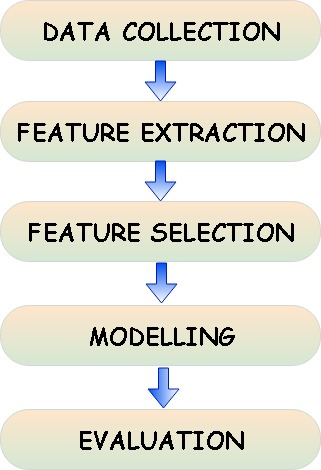
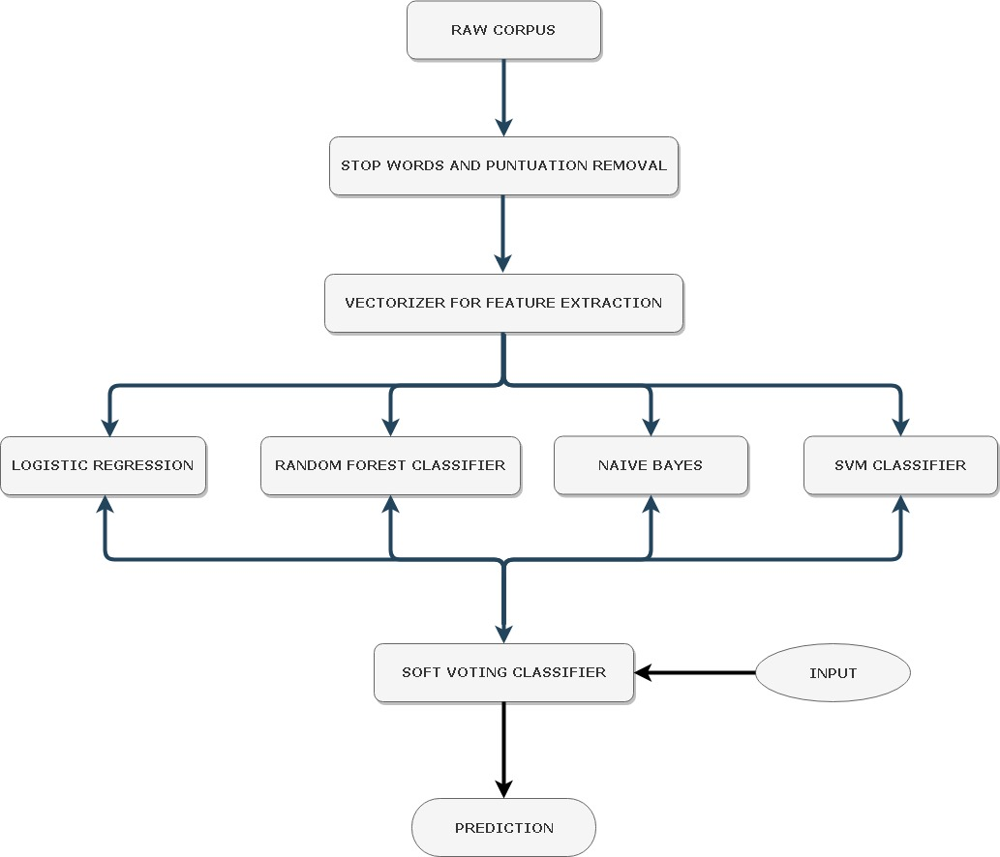

# Fake News Detection System

The proposed system was divided into stages to completely segregate the work based on the field of data mining operations like data collection, data preprocessing, feature extraction, feature selection and implementation of machine learning models for making the prediction for classifying the news into True or False and also predict the probability of the news belonging to the predicted label.

A number of machine learning models were implemented and the performance of the machine learning models were compared on the basis of metrics such as accuracy, f1 score, precision and recall. The main deciding metric for evaluating the performance of the models was chosen as f1 score that considers the tradeoff between precision and recall.

After the following machine learning models – SVM, Logistic Regression, Naïve Bayes and Random forest were trained and tuned, a Voting Classifier was implemented that combined all above mentioned models and formed an ensemble classifier that used all these classifiers to predict the label and class probability and used the soft voting method for making the final prediction.

__Proposed system steps:__



1. __Data Collection:__ For implementing and testing the proposed system, “Liar, Liar Pants on Fire: A New Benchmark Dataset for Fake News Detection” by William Yang Wang [[source](https://arxiv.org/abs/1705.00648)] was used. The dataset in this repository was already divided into training set, validation set and test set. The dataset includes 12,836 short statements labeled for truthfulness, subject, context/venue, speaker, state, party, and prior history. Initially the dataset labelled the news into six fine-grained labels for the truthfulness ratings: pants-fire, false, barely- true, half-true, mostly-true, and true.

2. __Data Preprocessing:__ For the proposed system, the six-label classification problem was converted into a binary classification problem with labels as True and False. The following mapping was used to convert the labels:

        • pants-fire --> False
        • false --> False
        • barely-true --> False
        • half-true --> True
        • mostly-true --> True
        • true --> True

    Also, for classification, only the news headline was used as the input. So, in the preprocessing stage, first of all the labels were mapped using the above defined mapping, then only the labels and news statement columns were extracted from the dataset and the extracted dataset was saved in csv format for future use.

    After the preprocessing, we obtained the following three cleaned files:

        • train.csv
        • valid.csv
        • test.csv

3. __Feature Extraction:__ To make the machine learning models gain insights from the news headlines, two approaches of feature extraction were used:

    1. __Count Vectorizer:__ Using scikit-learn’s CountVectorizer, first of all, the English stopwords were removed from all the news headlines and then they were tokenized using spaces and punctuation marks as the delimiter. After all the headlines were tokenized, a sparse matrix was returned that contained all the news headlines as rows and the tokens as the columns. Also, a number of n-grams were returned to make the tokens represent the context in which they were used in addition to their morphological use.
    2. __Tfidf Vectorizer:__ Using scikit-learn’s TfidfVectorizer, first of all, the English stopwords were removed from all the news headlines and then they were tokenized using spaces and punctuation marks as the delimiter. After all the headlines were tokenized, a sparse matrix was returned that contained all the news headlines as rows and the tokens as the columns. The similarity between the different headlines were calculated using the Tfidf similarity measure. Also, a number of n-grams were returned to make the tokens represent the context in which they were used in addition to their morphological use.

4. __Modelling__: Models used for training - Logistic Regression, Random Forest Classifier, Naïve Bayes and SVM Classifier.



5. __Methodology:__ The above-mentioned models were trained using the features extracted from both the CountVectorizer as well as TfidfVectorizer. After that, all the models were hyperparameter tuned for all the different possible parameters using GridSearchCV using 5 hold out cross validation set. This hyperparameter tuning was done to improve the f1-score of the models. After the models were tuned, they were tested on the test set and the evaluation metrics were calculated for the models.

    __Voting Classifier:__ The trained and tuned models were ensembled into a Voting Classifier that used all of them as the base estimator. When a new test data is passed to the Voting Classifier, it makes all the models under it to predict the label for the sample. After receiving the labels from all the models, using the soft voting measure, it predicts the final label of the test sample.

## Results and Discussions

1. __For Count Vectorizer:__

    Models | Accuracy | F1-score | Precision | Recall
    ---- | ---- | ---- | ---- | ----
    Logistic Regression | 56.353% | 72.084% | 56.353% |100.00%
    Naïve Bayes | 62.036% | 73.262% | 60.737% | 92.296%
    SVM Classifier | 56.669% | 72.117% | 56.573% | 99.439%
    Random Forest Classifier | 56.511% | 72.157% | 56.442% | 100.00%
    Voting Classifier | 60.457% | 72.933% | 59.336% | 94.537%

    From the results of the models on the different evaluation metrics when CountVectorizer is used as the feature extraction model, the best performing models is the Naïve Bayes model with a f1-score of 73.262% whereas the model with the least f1-score is SVM with that of 72.117%. From other evaluation metrics, we find that due to the small feature space of the headlines, all the models have recall more 92% whereas because of the same small space, the maximum precision achieved is 61%.

2. __For TFIDF Vectorizer:__

    Models | Accuracy | F1-score | Precision | Recall
    ---- | ---- | ---- | ---- | ----
    Logistic Regression | 63.141% | 71.437 % | 63.409 % | 81.792%
    Naïve Bayes | 60.536% | 73.290% | 59.240% | 96.078%
    SVM Classifier | 60.063% | 72.013% | 59.506% | 91.176%
    Random Forest Classifier | 57.221% | 72.487% | 56.847% | 100.0%
    Voting Classifier | 62.273% | 72.369% | 61.614% | 87.675%

    From the results of the models on the different evaluation metrics when TfidfVectorizer is used as the feature extraction model, the best performing models is the Naïve Bayes model with a f1-score of 73.290% whereas the model with the least f1-score is Logistic Regression with that of 71.437%. From other evaluation metrics, we find that as compared to CountVectorizer, the TfidfVectorizer used by models perform better in terms of precision and accuracy but does not do so well in terms of recall.

    Thus, from these findings, we can conclude that in terms of feature extraction TfidfVectorizer outperforms CountVectorizer.

## Repository Structure:

```bash
.
├── codes
├── datasets
├── figures
├── images
└── models
```

* __codes:__ This folder contains all the Python scripts as well as the Jupyter notebook relevant to the project.
* __datasets:__ This folder contains the initial datasets as well as the intermediate datasets created from the different processing steps.
* __figures:__ This folder contains the visualisations generated.
* __images:__ This folder contains the images used for creating the README file.
* __models:__ This folder contains the pickle file of the 2 final models created.

### Files inside the code directory:

